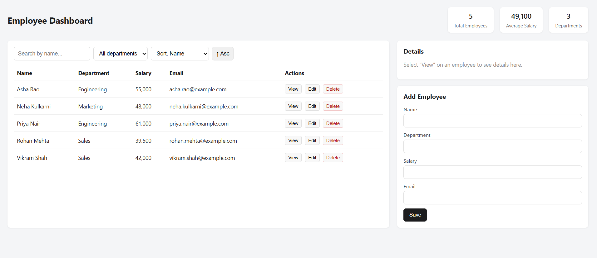

# Day 5 – JavaScript, Async Programming & APIs

## Project Overview
Day 5 covers core JavaScript, Promises, async/await, and the Fetch
API. The practical project is an Employee Dashboard: a browser app
that simulates a REST API using `localStorage` and async functions,
with full CRUD, search, filter, and sort.

## Problem Statement
Front-end apps rarely talk to a plain in-memory array — they call an
API that can be slow or fail. The task was to build a small
mock "API" layer (`api.js`) with realistic async delays and CRUD
endpoints, then build a UI (`app.js`) on top of it that handles
loading, errors, and state the way a real app connected to a backend
would.

## Features
- Add, view, search, edit, and delete employees
- Filter by department and sort by name/department/salary
  (ascending/descending)
- Live stats: total employees, average salary, department count
- Employee details panel
- Data persisted in the browser via `localStorage`, seeded with
  sample employees on first load
- Simulated network latency and error handling in the mock API layer

## Technology Stack
- HTML, CSS, JavaScript (ES6+)
- Browser `localStorage` API
- Promises / async-await (no external libraries or frameworks)

## Architecture
```
index.html (UI)
    ↓ user actions
app.js (state, rendering, event handlers)
    ↓ async calls: getEmployees / createEmployee / updateEmployee / deleteEmployee
api.js (mock REST layer)
    ↓ reads/writes
localStorage ("employee-dashboard-data")
```
`api.js` mimics a real backend: each function is `async`, applies an
artificial delay, and returns data the same shape a real REST API
response would.

## Database Design
Not applicable — data is stored as JSON in the browser's
`localStorage`, not in a database.

## API Documentation
No external API — `api.js` provides these local, in-app functions
(the mock equivalent of REST endpoints):

| Function | Equivalent | Description |
|---|---|---|
| `getEmployees()` | `GET /employees` | Returns all employees |
| `getEmployee(id)` | `GET /employees/:id` | Returns one employee |
| `createEmployee(data)` | `POST /employees` | Adds a new employee |
| `updateEmployee(id, updates)` | `PUT /employees/:id` | Updates an employee |
| `deleteEmployee(id)` | `DELETE /employees/:id` | Removes an employee |

## Installation
```bash
git clone <repo-url>
cd day-05/employee-dashboard
# No build step or dependencies — plain HTML/CSS/JS
```

## Environment Variables
Not applicable.

## How to Run
1. Open `employee-dashboard/index.html` directly in a web browser.
2. The dashboard loads seed data automatically (or your previously
   saved data from `localStorage`).
3. Use the search box, department filter, and sort controls, or the
   form to add/edit employees.

## Screenshots


## Challenges Faced
- Simulating a realistic API experience (loading states, delays,
  potential errors) without an actual backend server.
- Keeping `localStorage` data valid if it becomes corrupted or is
  manually edited.

## Solutions
- Wrapped every mock API call in a `delay()` helper using
  `setTimeout` inside a `Promise`, so the UI code has to handle
  loading states exactly as it would with a real network call.
- Wrapped `JSON.parse` of stored data in a `try/catch`, falling back
  to reseeding the default data if parsing fails.

## Future Improvements
- Replace the mock `api.js` with real `fetch()` calls to a backend
  (the pattern is carried forward with real APIs in Days 6–10)
- Add form-level validation feedback (e.g. inline error messages)
- Add pagination for large employee lists

## Author
**Mahak Sunil Kamble**
GitHub: [Mahak15-tech](https://github.com/Mahak15-tech)