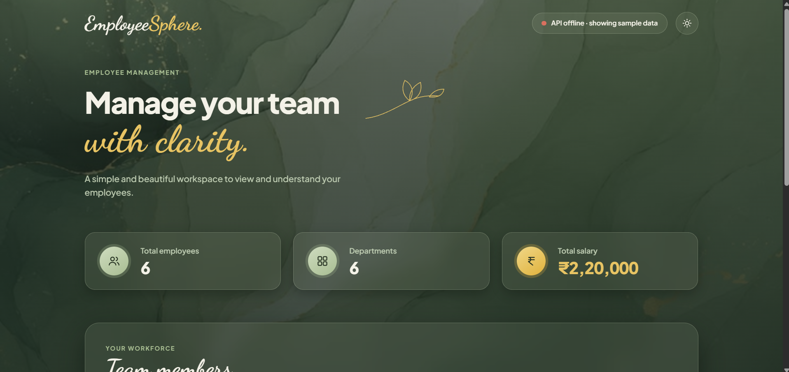

# Day 6 – EmployeeSphere (React + TypeScript)

## Project Overview
EmployeeSphere is an employee management dashboard rebuilt with React
and TypeScript, using Vite as the build tool. It continues the
Employee Dashboard concept from Day 5, this time as a typed,
component-based single-page application.

## Problem Statement
The Day 5 dashboard was plain JavaScript with manual DOM
manipulation. The goal for Day 6 was to rebuild the same kind of
tool using a component framework (React) and a type system
(TypeScript) to get type-safe props/state, reusable components, and
a faster development loop via Vite.

## Features
- View employee details
- Add new employees
- Edit employee information
- Delete employees
- Search employees
- Filter by department
- Calculate average salary
- Dark and light mode toggle
- Persistent data using `localStorage`
- Responsive design

## Technology Stack
- React 19
- TypeScript
- Vite (build tool + dev server)
- CSS
- Browser `localStorage`

## Architecture
```
main.tsx
   ↓ renders
App.tsx (top-level state: employees, theme)
   ├── AddEmployeeForm.tsx
   ├── EmployeeList.tsx
   │      └── EmployeeCard.tsx (per employee)
   └── services/employeeApi.ts → data/employees.ts (in-memory/local data)
```
Typed employee shape is defined once in `types/employee.ts` and
reused across every component and the API service, so props are
type-checked end to end.

## Database Design
Not applicable — data is held in local state / `localStorage`, not
in a database.

## API Documentation
Not applicable — `employeeApi.ts` currently reads from a local data
module (`data/employees.ts`) rather than a remote endpoint.

## Installation
```bash
git clone <repo-url>
cd day-06
npm install
```

## Environment Variables
Not applicable — no `.env` file is required for the current setup.

## How to Run
```bash
npm run dev
```
Then open the local URL Vite prints (typically
`http://localhost:5173`).

**Production build:**
```bash
npm run build
npm run preview
```

## Screenshots

|[Employee view](./screenshots/employees.png)

## Challenges Faced
- Modeling employee data with TypeScript interfaces while keeping
  components decoupled and reusable.
- Persisting and restoring theme (dark/light) and employee data
  across page reloads.

## Solutions
- Defined a shared `Employee` type in `types/employee.ts` so every
  component and service function references the same shape,
  catching mismatches at compile time.
- Used `localStorage` to persist both employee records and the
  selected theme, restoring them on mount with `useEffect`.

## Future Improvements
- Connect `employeeApi.ts` to a real backend (Day 7's Node API is a
  natural fit) instead of local static data
- Add form validation with inline error messages
- Add unit tests for components with a testing library

## Learning Outcomes
- React components and hooks (`useState`, `useEffect`, `useMemo`)
- TypeScript interfaces and typed props
- Form handling in React
- Responsive CSS
- `localStorage` for client-side persistence

## Author
**Mahak Sunil Kamble**
GitHub: [Mahak15-tech](https://github.com/Mahak15-tech)