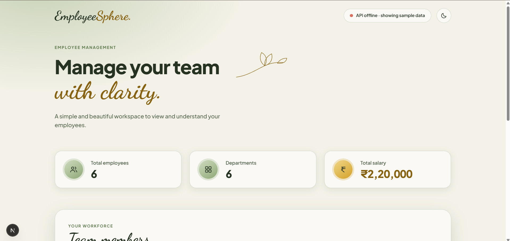
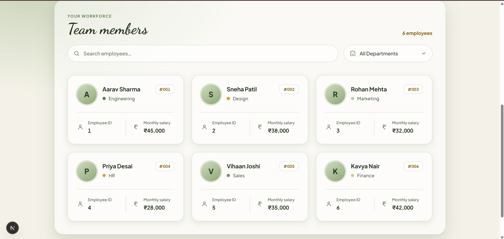

# Day 7 – Next.js and Node.js Employee Dashboard

## Project Overview
**EmployeeSphere** (Next.js edition) is an employee management
dashboard built with Next.js on the frontend and a Node.js/Express
REST API on the backend. It displays employee information fetched
over HTTP, with search and department filtering.

## Problem Statement
Days 5 and 6 kept data local to the browser (`localStorage`/static
data). Day 7's goal was to separate frontend and backend into two
real services — a Next.js app that fetches from a genuine REST API,
and a small Express server that serves that data — mirroring a real
client/server architecture.

## Features
- Display employee details fetched from a live API
- Search employees by name
- Filter employees by department
- Calculate total employees, total departments, and total salary
- Frontend connects to the backend over HTTP (CORS-enabled)
- Responsive dashboard design

## Technology Stack
| Layer | Technology |
|---|---|
| Frontend | Next.js, React, TypeScript, CSS |
| Backend | Node.js, Express.js, CORS |
| Data | REST API (JSON, in-memory array) |

## Architecture
```
nextjs-app (React UI, port 3000)
        ↓ fetch("http://localhost:5000/api/employees")
node-api (Express server, port 5000)
        ↓ serves
in-memory employees array
```
The Express server holds employee data in memory and exposes it as
JSON; the Next.js app fetches it client-side and renders the
dashboard, with search/filter applied in the browser.

## Database Design
Not applicable — the API serves an in-memory JavaScript array, not a
persistent database (see Day 8/Day 10 for database-backed versions).

## API Documentation
| Method | Endpoint | Description |
|---|---|---|
| `GET` | `/api/employees` | Returns all employee records as JSON |

**Example response:**
```json
[
  { "id": 1, "name": "Asha Rao", "department": "IT", "salary": 55000 }
]
```

## Installation
```bash
git clone <repo-url>
cd day-07

# Install backend dependencies
cd node-api
npm install

# Install frontend dependencies
cd ../nextjs-app
npm install
```

## Environment Variables
Not applicable in the current setup — the frontend calls the API at
a hard-coded `http://localhost:5000` URL. For production, this
should move to an environment variable such as
`NEXT_PUBLIC_API_URL`.

## How to Run
**1. Start the Node.js API:**
```bash
cd node-api
npm install
node server.js
```
Runs at `http://localhost:5000`.

**2. Start the Next.js application** (in a second terminal):
```bash
cd nextjs-app
npm install
npm run dev
```
Runs at `http://localhost:3000`.

> Start the API first so the dashboard has data to load.

## Screenshots


## Challenges Faced
- Getting the Next.js frontend and the separate Express backend to
  communicate cleanly across two different local ports/origins.

## Solutions
- Enabled `cors()` middleware on the Express server so the Next.js
  app (running on a different port) can fetch the API without
  cross-origin errors.

## Future Improvements
- Move the API base URL into an environment variable instead of a
  hard-coded string
- Replace the in-memory array with a real database (e.g. via Day 8's
  Laravel API or a Node ORM)
- Add loading and error states to the fetch call in the UI

## Learning Outcomes
- The Next.js App Router
- React state and effects for data fetching
- Building a Node.js/Express REST server
- Working with TypeScript in a Next.js project
- Building responsive dashboards

## Author
**Mahak Sunil Kamble**
GitHub: [Mahak15-tech](https://github.com/Mahak15-tech)