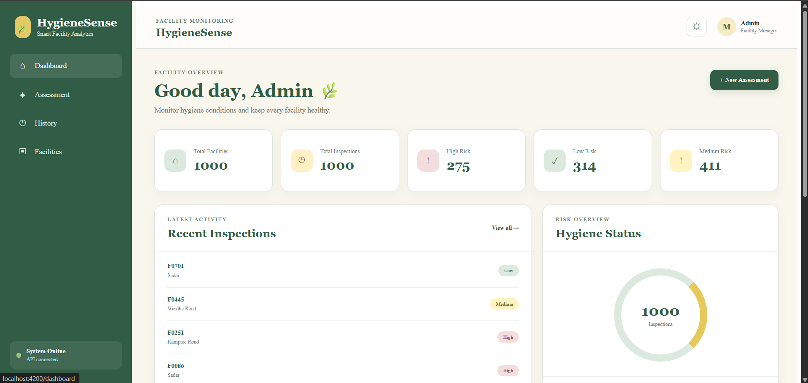

# Day 9 – Angular, RxJS & API Integration

## Project Overview
Day 9 is a facility management application built with Angular,
RxJS, and a Node.js/Express REST API. The Angular frontend connects
to the Express backend, which serves data derived from a real
facility hygiene dataset, and the app displays facility records,
inspection history, and a hygiene risk dashboard.

## Problem Statement
Facility inspection data (cleanliness score, odor score, waste
level, water availability, footfall, complaints) needs to be
collected, stored, searched, and turned into an at-a-glance risk
picture. The goal was to build an Angular frontend — with proper
services, routing, and RxJS-based API communication — backed by a
real REST API serving facility and inspection data, rather than
working with hard-coded or local-only data.

## Features
**Dashboard**
- Total facilities and total inspections
- High, medium, and low-risk counts
- Recent inspection records
- Registered facility overview

**Facility Management**
- Display facility records
- Search facilities by ID or location
- Refresh facility data
- View facility status

**Hygiene Assessment**
- Form to submit: Facility ID, cleanliness score, odor score, waste
  level, water availability, daily footfall, number of complaints
- Calculates hygiene risk level (Low / Medium / High)
- Saves the assessment through the backend API

**Inspection History**
- View inspection records
- Search by facility or location
- Filter by risk level
- View inspection measurements and dates

## Technology Stack
- Angular, TypeScript
- HTML5, CSS3
- RxJS (Observables)
- Node.js, Express.js
- REST API
- XLSX (dataset source)
- Git & GitHub

## Architecture
```
Facility Hygiene Dataset (facility_hygiene_ml_dataset.xlsx)
          ↓
     Node.js + Express (backend/server.js)
          ↓
       REST API  (http://127.0.0.1:5002)
          ↓
 Angular Service (services/)
          ↓
     RxJS Observable
          ↓
 Angular Components
          ↓
 Dashboard / Facility List / Inspection Form / Inspection History
```

**Project structure:**
```text
day-09/
├── angular-app/            Previous Angular practice project
├── angular-project/        Current facility management app
│   ├── src/app/
│   │   ├── components/
│   │   │   ├── dashboard/
│   │   │   ├── facility-list/
│   │   │   ├── inspection-form/
│   │   │   └── inspection-history/
│   │   ├── models/
│   │   ├── services/
│   │   ├── app.ts / app.html / app.css
│   │   └── app.routes.ts
│   └── package.json
├── backend/
│   ├── data/facility_hygiene_ml_dataset.xlsx
│   ├── server.js
│   └── package.json
├── api-integration/
└── README.md
```

## Database Design
Not applicable — there is no relational database. The backend reads
facility and inspection data from `facility_hygiene_ml_dataset.xlsx`
and serves it through the Express API.

## API Documentation
| Method | Endpoint | Description |
|---|---|---|
| `GET` | `/api/facilities` | Get all facilities |
| `GET` | `/api/facilities/:id` | Get a single facility by ID |
| `GET` | `/api/inspections` | Get all inspections |
| `GET` | `/api/inspections?facility_id=FAC-1001` | Get inspections for a specific facility |
| `POST` | `/api/inspections` | Submit a new inspection |

Base URL: `http://127.0.0.1:5002`

## Installation
```bash
git clone <repo-url>
cd day-09

# Backend
cd backend
npm install

# Frontend
cd ../angular-project
npm install
```

## Environment Variables
Not applicable — the backend port (`5002`) and API base URL are
currently set directly in `server.js` and the Angular services
rather than via environment files.

## How to Run
**1. Start the backend** (in PowerShell or any terminal):
```bash
cd day-09/backend
node server.js
```
The API runs at `http://127.0.0.1:5002`.

**2. Start the Angular application** (in a second terminal):
```bash
cd day-09/angular-project
npx ng serve
```
Then open `http://localhost:4200`.

> Start the backend first so the dashboard, facility list, and
> inspection history have data to load.

## Screenshots




## Challenges Faced
- Turning a static dataset (`facility_hygiene_ml_dataset.xlsx`) into
  a queryable REST API that supports filtering (by facility ID,
  location, and risk level) instead of just returning the whole
  file.
- Keeping the Angular frontend and the separate Express backend in
  sync across two different local ports/processes.

## Solutions
- Built dedicated Express routes (`/api/facilities`,
  `/api/inspections`) that read and filter the dataset server-side
  based on query parameters (e.g. `facility_id`), so the Angular app
  only ever needs to call a REST endpoint rather than parsing the
  spreadsheet itself.
- Used Angular services with RxJS `Observable`s to centralize all
  HTTP calls to `http://127.0.0.1:5002`, so every component consumes
  the same consistent API layer.

## Future Improvements
- Move the backend port and API base URL into environment
  configuration (Angular `environment.ts` + a Node `.env` file)
- Replace the Excel-file data source with a proper database once
  inspection volume grows
- Add loading and error states across all views
- Add authentication before allowing new inspections to be submitted

## Learning Outcome
By completing Day 9, I learned how to build an Angular application,
create reusable services, consume REST APIs using RxJS, manage
application routing, and connect a frontend application with a
Node.js backend.

## Status
- Angular Application: Completed
- REST API Integration: Completed
- Dashboard: Completed
- Facility Management: Completed
- Hygiene Assessment: Completed
- Inspection History: Completed
- Testing: Completed

## Author
**Mahak Sunil Kamble**
GitHub: [Mahak15-tech](https://github.com/Mahak15-tech)